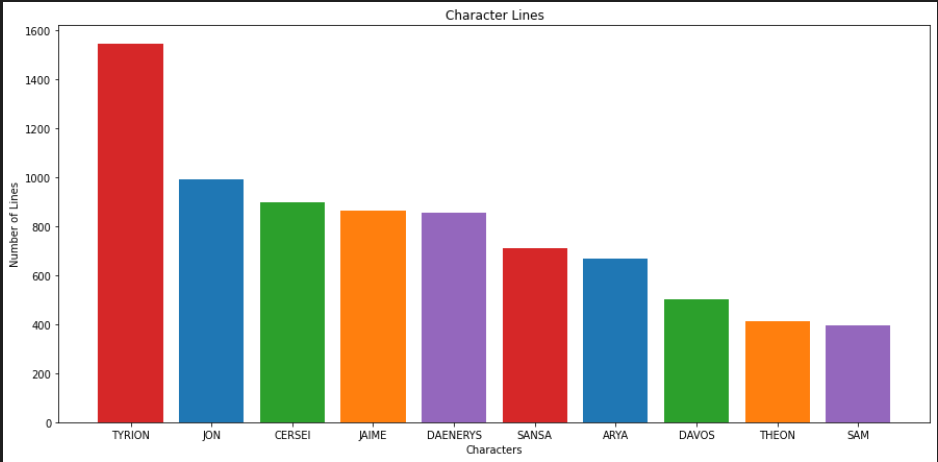
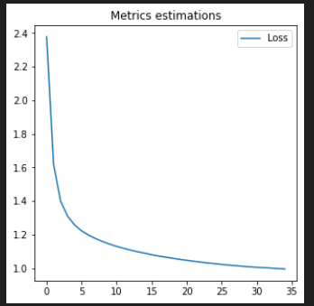

# Game of Thrones Script Generator


This README is an outline of the steps taken to create this project. More detailed comments are provided in the code for specifics. This project has a single ipynb file for the code called **ai-GOT-script-generator.ipynb**. This file handles all of the code from processing the txt files to producing an output that imitates the game of thrones script. The **Data** folder contains all of the txt files for GOT episodes downloaded from shekharkoirala on github [HERE](https://github.com/shekharkoirala/Game_of_Thrones). The **Training** file is a directory that is meant to save the weights of a model after each training epoch. There are some preloaded weights in this directory if the user wishes to start with those. Finally, the **merged_file.txt** contains all of the scripts combined into a single txt file. 

### Overview
1. Introduction
2. Loading the Text
3. Analyzing the Script
4. Processing the Characters
5. Building the Model
6. Results
7. Future Additions


### Introduction
Game of Thrones is one of my favorite shows, and after looking at other text generators I thought this would be the perfect TV show to try and create a script for. The show has eight seasons, and plenty of diverse characters and vocabulary to make for an interesting project. The recurrent neural network in this notebook is not particularly large or complex to avoid significantly long training times, but the output is still understandable and quite entertaining. 

In addition to training the model on all 8 seasons of script, I added a feature that allows the model to be trained on dialog from any character in the show. With enough training, this should produce a model that produce text similar to the dialog of **Jon Snow** for example. 

More information about the series can be found on the [Game of Thrones Wikipedia](https://en.wikipedia.org/wiki/Game_of_Thrones)

### Loading the Text
The first step was to combine all of the individual episode txt files into a single txt file that could be read. The following code segment acheives this and stores the result in **merged_file.txt** for easier acess.

```
inputs = []
for file in os.listdir("Data"):
    if file.endswith(".txt"):
        inputs.append(os.path.join("Data", file))

with open('merged_file.txt', 'w') as outfile:
    for fname in inputs:
        with open(fname, encoding="utf-8", errors='ignore') as infile:
            outfile.write(infile.read())
```
The next step was to remove any unnecary characters such as the carriage return "\r" and tabs"\t" and to strip the whitespace from the ends of each line in the file. This way the model will not be trained to produce excess whitespace. 

### Analyzing the Script
The enitre GOT script is 2,474,457 characters long with 95 unique characters after removing the symbols descirbed above. this is a very robust amount of data that will make training the model easier and less likely to overfit. 

I then separated the script into lines by specific characters. To do this, I had to solve several challenges:
1. How to tell if a line is dialog or just setting a scene
2. How to differentiate a character name and a word
3. Count the number of lines per character, and store these lines elsewhere

This was done by recognizing all character dialog starts with the character name in all caps followed by a semicolon. For example: **CERCEI: I love my children**
I was then able to iterate over each line storing the characters in a `name` variable. I stopped storing characters once I encountered a semicolon, and cleared the name variable if I reached the end of the line. Furthermore, to fix encountering a semicolon in normal dialog, I cleared the name variable once the string was 20 characters long (since nobody has a name that long). I then stored the line in a dictionary with the key being the name variable, and the value being a concatenated string of all the character lines. Even after some more tranformations (detailed in the code), the final dictionary still had some keys that were not people in the show. One example is **EXT** which means "exit" in the script. These few mistakes were removed manually.

The final dictionary was converted to a list and sorted in descending order. Characters below a specified threshold of lines were dropped. The results were plotted as seen in the graph below. To my suprise Tyrion had the most lines in the series by far!



### Processing the Characters
A simple but important step in the process is to assign a numerical index to each unique character in the text. Since the script had 95 unique characters, each of these was given a number in the range 0-94. For instance the letter 'a' is represented by a 56 in this case. Then the entire text can be converted to an array of numbers instead of a long string. This is important for training the model.

Also, a sequence length of 100 was chosen. This simply means that the model will have 100 characters of previous context when it is trying to predict the next letter. The text therefore has to be split up into chunks of 100 characters each which I did. 
```
char_to_idx = dict((c, i) for i, c in enumerate(vocab))
idx_to_char = np.array(vocab)
text_as_int = np.array([char_to_idx[c] for c in text])
```

Next I created the `input_text` and `target_text` variables which are misaligned by one character. This is necessary so that the model can be trained to predict the next character in the sequence. For instance, if the input is **Hello World**, then the output would be **ello World!**. As you can see, at index 0 the input is **H** and the output is **e**. So, the model is being trained to ouput an e after the H. Each character in the input sequence is mapped to the appropriate target character for quick acess. I then shuffled the input and target sequences in the dataset to get more diverse training of the model. Basically, the script is no longer in order, it is made up of shuffled lines of 100 characters. 

### Building the Model
There are many types of nueral networks to choose from, but for this project the clear best choice was a Recurrent Neural Network. RNNs are a great choice for creating text because they can remember what came before and use that information in thier predictions unlike normal neural netowrks. This makes them better at understanding the order and connection between words in a sentence or a paragraph. So, when RNNs generate text, they can use this memory to make the text sound more natural and meaningful. RNNs are often used for tasks like writing and completing sentences which is very similar to the goal of this project. 

I first set a batch size of 64 which means the model will update its weights after 64 predictions. I also chose the number of recurrent neural network units as 512. The more of these you have the more complex your model will be, however runtime will also go up. I had to move it down from 1024 for this reason, but more units should yeild a better result. The ouptut layer is a dense layer with a size equal to the number of unique characters. The `glorot_uniform` initializer means that the ouptut will also be a probability distribution with a float value assigned to each character based on the likelyhood the model beleives it comes next. 
```
vocab_size = len(vocab)
embedding_dim = 256
rnn_units = 512

def build_model(vocab_size, embedding_dim, rnn_units, batch_size):
    model = tf.keras.Sequential([
    tf.keras.layers.Embedding(vocab_size, embedding_dim,
                              batch_input_shape=[batch_size, None]),
    # Recurrent NN architechture
    tf.keras.layers.GRU(rnn_units,
                        return_sequences=True,
                        stateful=True,
                        recurrent_initializer='glorot_uniform'),
    tf.keras.layers.Dense(vocab_size)
  ])
    return model
```
When training the model I used categorical crossentropy to compute the loss, and the `adam` optimizer to adjust the weights. The code and a graph depicting the loss over each epoch is shown below. 
```
def loss(labels, logits):
    return tf.keras.losses.sparse_categorical_crossentropy(labels, logits, from_logits = True )
model.compile(optimizer = 'adam', loss = loss)
```


### Results

I designed a simple function that takes in a seed (up to 100 chars long), and then uses this seed to start predicting text. The amount of text generated can be adjusted. I also chose a temperature of .9. The `temperature` variable will change the "riskiness" of the model in how it chooses the next character. For instance, if the temperature is 1 the model will always choose the highest probability character. But if it is lower at say .2, it will be very random in what character it chooses. If overfitting or lack of diversity is an issue, this value should be lowered. Here is an example call of the `predict_text` function:
```
gen_length = 1000
temperature = .9
seed = "The White Walkers are coming, do we fight or do we run?"
print(predict_text(model, gen_length, temperature, seed))
```
**And here is an example of an ouput:**

*The White Walkers are coming, do we fight or do we run?
MISSANDEI: (speaks Valyrian)*

*MARGAERY: He couldn't dicleplace it, corred for the Seven Kingdoms.  There has no emergestand.  Can we your father again. A man who divides his kwill placed in the courtyard and pleased and pulls the tie love to able the Dothraki banner in the anch as the village is not. I suppose that's wrong. You sit or do you were men. And words in the key, but the world was when does she return.*

*LITTLEFINGER: I will make it to Casterly Rock. Hodor captured his money gription.  A shadow in the surviving continues.*

*BRYNDEN shufts the stoly high to rule in this side standing away.*

*JAIME: I am the beach us in the hall. CERSEI and VALYNE exchange  DOLOROUS EDD and PODRICK enter.*

*MARGAERY: You won't march on Tarth as two people always care about. And I don't have.*

*MELISANDRE: I was Gilly do you think she's yours.  Everyone who sut the seclet with the marketplace outside the Mountain. It heads from the way, I need you to come with me. I don't think that.*

*EURON she laws, talls*

As you can see, the results do not make a lot of sense. However, considering this specific example was generated after only a few hours of training on a slimmed down model (so my laptop did't explode), I think these are quite decent results. There are a lot of fun characters, mentions of places in GOT, and most words are spelled correctly. With more training, I think this model would be considerealby more accurate. 

